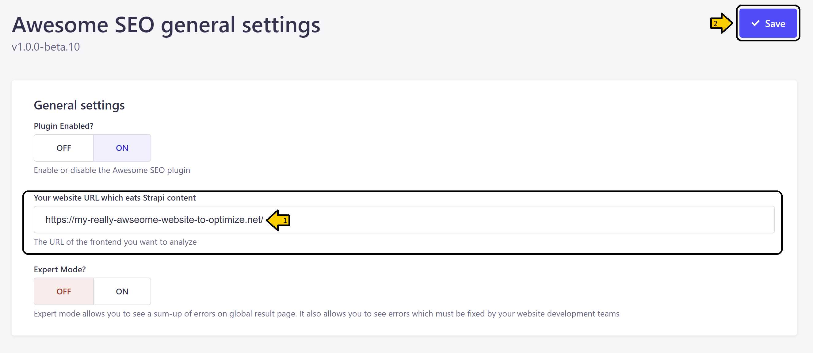
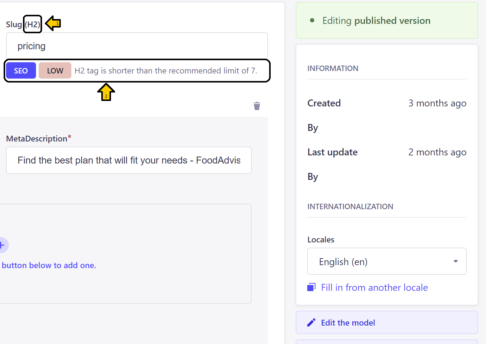

# AWESOME SEO <!-- omit in toc -->


- [DESCRIPTION](#description)
- [FEATURES](#features)
- [INSTALLATION](#installation)
- [CONFIGURATION](#configuration)
  - [Our awesome tips …](#our-awesome-tips-)
- [WHAT IS INCLUDED IN OUR PLUGIN](#what-is-included-in-our-plugin)
- [ROADMAP](#roadmap)


> This plugin is still a work in progress

## DESCRIPTION  
Awesome SEO allows your content manager in one click to get the results of your website SEO analysis directly available in Strapi.  
It's easy to use. In Strapi :  
* set-up your website URL  
* launch the analysis of the SEO of your website  
* direcly see for each page of your website the SEO errors linked to your strapi content.  

From now, each time your content manager set-up new content, he will be informed of the impact on the SEO notation  in real-time and before pushing the content !  

## FEATURES  
* SEO analysis of your website
* SEO Errors overview for your whole website sorted by page ranking (most important page for your SEO at the top)
* Direct access to Strapi content to fix the errors. 
* Errors are highlighted in your content types.
* Real-time alert when creating new content or updating current content if you modification downgrades the SEO Notation
* Expert mode which also allows the content manager to see SEO issues created by the website development team
Screenshot to add for each feature.

## INSTALLATION  
Prerequisites : Chrome must be installed on your server
```bash
#npm
npm install @exfabrica/strapi-plugin-awesome-seo
```
```bash
#yarn
yarn add @exfabrica/strapi-plugin-awesome-seo
```

## CONFIGURATION  
1. In the general settings of Awesome SEO, enter your website *(1)* for which you want to improve the SEO and save your settings *(2)*.  
   


2. Open the plugin “Awesome SEO” and start by launching a scan of your website *(1)*  
   
  

> ⏱**The scan can takes several minutes**  
> ⚠️<span style="color:orange">**If you have activated the advanced parameters « find hidden links » the scan can be really long (we are currently working on an optimization for next version).**</span>

3. See your results with a global sum-up of SEO errors for your website *(1)*, a sum-up by website page *(2)*, ordered by rank. You can then go deeper in the Strapi content page by clicking on the modification button *(3)* to solve your errors.  
   
.png) 

4. By clicking the modification button on previous screen you can see directly in your Strapi content type your tags *(1)* and SEO errors *(2)* and fix them. Awesome !  
   
  

### Our awesome tips …  
* tip \#1 : in general settings you can activate an expert mode. You’ll get a different result overview with detailed information and 2 classifications of errors : fixable by the content manager, fixable by your website development team.  
* tip \#2 : we invite you not to activate the “find hidden link” option in advanced settings. Even if it works, the algorithm is not yet optimized and your analyze can take … real long time. Don’t worry, our awesome team is working on it for next version.  
* tip \#3 : if you’re fed up with viewing errors directly in content type, you can deactivate it in general settings.  
* tip \#4 : when you’ll create new content in already analyzed collection types, you’ll get some advices for optimizing your SEO during your content creation. Awesome !  
* tip \#5 : when all errors are fixed, you need to relaunch scanning to see errors disappear from your results overview. Relax ! We are working on a next version to update instantly the results page.  
* tip \#6 : a page without errors doesn’t appear in results. We are working on a next version to allow user to see it.  


## WHAT IS INCLUDED IN OUR PLUGIN
Our plugin is currently checking the following SEO rules (to be improved in coming versions) : [Implemented SEO rules](docs/Implemented-SEO-rules.html).

## ROADMAP
Next step for the plugin : 
* Asynchronous and optimization of analysis duration
* Improve SEO Analysis : new rules analyzed
* Real time relaunch of analysis after fixing element

